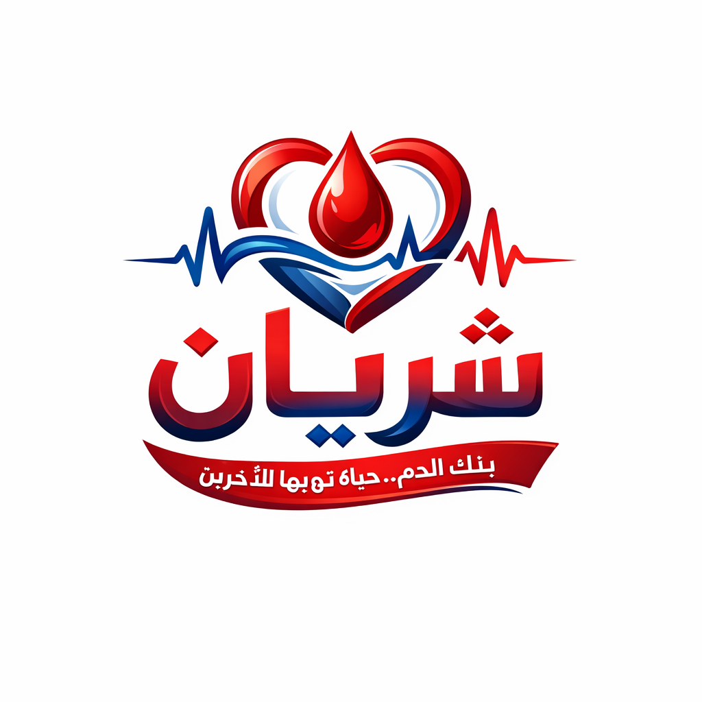
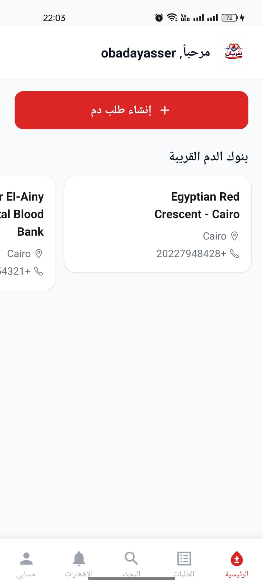
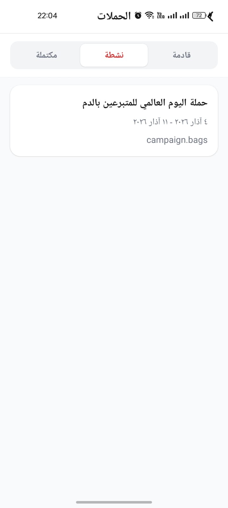
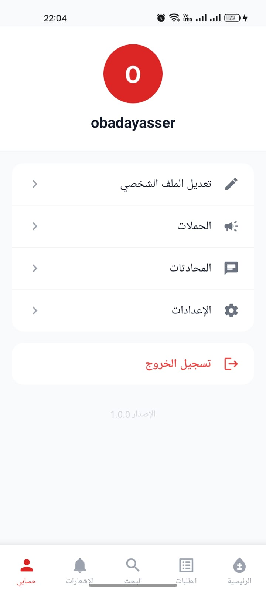

<!-- SLIDE 1 - TITLE -->

<div align="center">



# **SHARYAN**
### Blood Donation Platform
#### *Your Blood, A Life for Others*

<br>

**Abdulrahman Yasser Ahmed** - `20232493`
**Abdullah Atef** - `20232222`

*Faculty of Computer Science | University Project 2025-2026*

</div>

---

<!-- SLIDE 2 - TABLE OF CONTENTS -->

## Table of Contents

| # | Section | # | Section |
|:-:|---------|:-:|---------|
| 1 | Project Concept & Problem | 9 | App Screens - Requests & Search |
| 2 | Key Benefits | 10 | App Screens - Campaigns & Profile |
| 3 | System Architecture | 11 | Application Flowchart |
| 4 | Mobile Technologies | 12 | Database Schema |
| 5 | Backend Technologies | 13a | API Architecture |
| 6 | User Types & Roles | 13b | Real-Time & Notifications |
| 7 | App Screens - Registration | 14 | Conclusion |
| 8 | App Screens - Home | 15 | Future Work |

---

<!-- SLIDE 3 - PROJECT CONCEPT -->

## 1. Project Concept & Problem Statement

**The Problem:**

- Egypt faces **chronic blood shortages** in hospitals and blood banks
- No efficient **digital platform** connects donors with patients in real-time
- Patients' families waste **critical hours** searching for compatible donors
- Blood banks lack **visibility** into available donors nearby
- No **incentive system** to encourage regular blood donation

**Our Solution: Sharyan** (Arabic: "Artery")

- **Connects** patients who need blood with available donors instantly
- **Locates** nearby compatible donors using **GPS-based matching**
- **Manages** blood bank inventory and shortage alerts in real-time
- **Motivates** donors through **gamification** (points, badges, leaderboards)
- **Facilitates** communication via **real-time chat**
- Supports **Arabic & English** with full RTL interface

---

<!-- SLIDE 4 - BENEFITS -->

## 2. Key Benefits

| Benefit | Description |
|---------|-------------|
| **Saves Lives** | Reduces time to find compatible donors from hours to minutes |
| **Location-Based** | GPS-powered donor search with configurable radius (up to 50 km) |
| **Real-Time** | Instant notifications, live chat, and WebSocket-powered updates |
| **Gamification** | Points, badges, and leaderboards encourage repeat donations |
| **Blood Bank Management** | Full inventory tracking with shortage alerts |
| **Campaigns** | Blood banks can create and manage donation campaigns |
| **Bilingual (AR/EN)** | Full Arabic and English support with RTL |
| **Push Notifications** | Firebase FCM for instant mobile alerts |
| **Smart Matching** | Blood type compatibility algorithm finds the right donors |
| **Secure** | JWT authentication, encrypted storage, device-based auth |

---

<!-- SLIDE 5 - SYSTEM ARCHITECTURE -->

## 3. System Architecture

```
  CLIENT LAYER
  +--------------------------+     +-------------------------+
  |     Mobile App           |     |     Admin Panel         |
  |  (React Native + Expo)   |     |     (Next.js Web)       |
  +-----------+--------------+     +------------+------------+
              |        REST API + WebSocket      |
  +-----------v---------------------------------v------------+
  |                    SERVER LAYER                           |
  |                  NestJS Backend                           |
  |                                                          |
  |  [Auth/JWT] [14+ Modules] [WebSocket Gateway] [Firebase] |
  +-------------------------+--------------------------------+
                            |
  +-------------------------v--------------------------------+
  |                    DATA LAYER                             |
  |   [PostgreSQL + Prisma ORM]    [Firebase FCM]            |
  +----------------------------------------------------------+
```

**14+ Backend Modules:** Auth, Admin, Donor, Patient, Blood Bank, Blood Request, Blood Stock, Donation, Donation Offer, Campaign, Notification, Chat, Gamification, Share, SMS, Geo, Firebase

---

<!-- SLIDE 6 - MOBILE TECHNOLOGIES -->

## 4. Mobile App Technologies - React Native + Expo SDK 54

| Library | Version | Purpose |
|---------|---------|---------|
| **react-native** | 0.81.5 | Core mobile framework |
| **@react-navigation/native** | ^7.1.8 | Navigation infrastructure |
| **@react-navigation/bottom-tabs** | ^7.4.0 | Bottom tab bar |
| **react-native-reanimated** | ~4.1.1 | High-performance animations |
| **react-native-gesture-handler** | ~2.28.0 | Touch gesture handling |
| **moti** | ^0.30.0 | Animation library (Reanimated) |
| **twrnc** | ^4.16.0 | TailwindCSS for React Native |
| **expo-location** | ~19.0.8 | GPS location services |
| **expo-notifications** | ~0.32.16 | Push notification handling |
| **expo-image** | ~3.0.11 | Optimized image rendering |
| **i18next + react-i18next** | ^25.8 / ^16.5 | Internationalization (AR/EN) |
| **socket.io-client** | ^4.8.3 | Real-time WebSocket |
| **@react-native-async-storage** | 2.2.0 | Persistent local storage |

---

<!-- SLIDE 7 - BACKEND TECHNOLOGIES -->

## 5. Backend Technologies - NestJS + PostgreSQL + Prisma

| Technology | Purpose |
|------------|---------|
| **NestJS** v11 | TypeScript backend framework (modular architecture) |
| **PostgreSQL** | Relational database for all application data |
| **Prisma ORM** v5.22 | Type-safe database access & migrations |
| **Passport + JWT** | Admin authentication (access + refresh tokens) |
| **Socket.IO** v4.8 | Real-time WebSocket for chat & notifications |
| **Firebase Admin SDK** | FCM push notifications to mobile devices |
| **class-validator** | Request DTO validation & enforcement |
| **class-transformer** | Request/response data transformation |
| **Swagger (OpenAPI)** | Auto-generated interactive API docs at `/docs` |
| **bcrypt** | Secure password hashing (salt rounds: 10) |
| **uuid** | Unique identifier generation for share tokens |
| **rxjs** | Reactive programming utilities |
**API Stats:** 81 REST endpoints | 2 WebSocket gateways | 18 database tables

---

<!-- SLIDE 8 - USER TYPES -->

## 6. User Types & Roles

| Role | Authentication | Key Capabilities |
|------|---------------|------------------|
| **Donor** | Device ID (`X-Device-ID` header) | Register, update profile, search blood requests, offer to donate, chat with patients, earn points & badges |
| **Patient** | Device ID (`X-Device-ID` header) | Register, create blood requests, notify nearby donors, accept/reject offers, chat with donors, share request links |
| **Blood Bank** | Device ID (`X-Device-ID` header) | Register (pending admin approval), manage blood inventory, create donation campaigns, issue shortage alerts |
| **Admin** | JWT Bearer Token (email + password) | Dashboard statistics, approve/reject blood banks, manage all users, verify donations, broadcast notifications |

**Authentication Methods:**
- **Mobile Users**: Unique device ID + user type headers (no password needed)
- **Admins**: Email/password login -> JWT access token (15 min) + refresh token (7 days)

---

<!-- SLIDE 9 - APP SCREENS: REGISTRATION -->

## 7. App Screens - Registration & Onboarding

<div class="columns">
<div class="col">

**Account Type Selection**

Three account types:
- **Donor** (Red border)
- **Patient** (Blue border)
- **Blood Bank** (Green border)

Each with Arabic description and icon.

**Donor Registration** collects:
- Name, Phone number
- Blood Type (8 types)
- Gender (Male/Female)
- GPS Location (auto-detect)

</div>
<div class="col" align="center">

 

</div>
</div>

---

<!-- SLIDE 10 - APP SCREENS: BLOOD BANK REG + HOME -->

## 8. App Screens - Blood Bank Registration & Home

<div class="columns">
<div class="col">

**Blood Bank Registration** collects:
- Name, Phone, Email
- Address, City
- License Number
- GPS Location (auto-detect)
- *"Your application will be reviewed by admin"*

**Home Screen** shows:
- Welcome message + Sharyan logo
- **"Create Blood Request"** red button
- **Nearby Blood Banks** cards
- Bottom nav: Home, Requests, Search, Notifications, Account

</div>
<div class="col" align="center">

 

</div>
</div>

---

<!-- SLIDE 11 - APP SCREENS: REQUESTS + SEARCH -->

## 9. App Screens - Blood Requests & Donor Search

<div class="columns">
<div class="col">

**My Requests** page:
- Lists all blood requests by the patient
- Shows status tracking
- Empty state: "No blood requests currently"

**Donor Search** page:
- Two tabs: **Donors** | **Blood Banks**
- Filter by blood type
- Each donor card shows:
  - Name with avatar
  - Blood type badge
  - Availability (green dot)

</div>
<div class="col" align="center">

 

</div>
</div>

---

<!-- SLIDE 12 - APP SCREENS: CAMPAIGNS + SETTINGS -->

## 10. App Screens - Campaigns & Profile

<div class="columns">
<div class="col">

**Campaigns** page:
- Status tabs: **Upcoming | Active | Completed**
- Campaign cards show:
  - Title (Arabic)
  - Date range
  - Bag collection target

**Profile & Account** page:
- User avatar with initial
- Menu items:
  - Edit Profile
  - Campaigns
  - Chats
  - Settings
  - Logout
- App version at bottom

</div>
<div class="col" align="center">

 

</div>
</div>

---

<!-- SLIDE 13 - FLOWCHART -->

## 11. Complete Application Flowchart

```
                        [App Launch] --> [Select Account Type]
                                |
              +-----------------+-----------------+
              v                 v                 v
          [DONOR]          [PATIENT]        [BLOOD BANK]
              |                 |                 |
        [Register:        [Register:        [Register:
        Name, Blood       Name, Phone]      Name, License,
        Type, GPS]             |             Address, GPS]
              |                |                 |
              |                |          [Pending Admin
              |                |           Approval]
              |                |                 |
          [HOME PAGE]    [HOME PAGE]       [HOME PAGE]
           /    \           /    \            /    \
    [Search] [Offer]  [Create]  [Chat]  [Manage] [Create
     Donors   to       Blood    with     Stock    Campaign]
              Donate   Request  Donors      |        |
              |           |               [Alert  [Donor
        [Earn Points]  [Notify            Short-  Regist-
         & Badges]      Nearby            age]    rations]
                        Donors]
                           |
                     [Receive Offers] --> [Accept/Reject] --> [Donation Complete]
                                                                     |
                              [ADMIN DASHBOARD] <--------------------+
                              - Approve Blood Banks | View Stats
                              - Manage Users | Verify Donations
                              - Broadcast Notifications
```

---

<!-- SLIDE 14 - DATABASE PART 1 -->

## 12. Database Schema - Core Tables

<div class="columns">
<div class="col">

| Table | Key Fields |
|-------|-----------|
| **Admin** | email, passwordHash, isSuperAdmin |
| **Donor** | name, bloodType, GPS, points, fcmToken |
| **Patient** | name, mobile, GPS, fcmToken |
| **BloodBank** | name, status, licenseNumber, GPS |
| **BloodRequest** | bloodType, bagsNeeded, urgency, status |
| **DonationOffer** | donorId, requestId, status |
| **Donation** | donorId, bloodType, pointsAwarded |

</div>
<div class="col">

| Table | Key Fields |
|-------|-----------|
| **BloodStock** | bloodType, bagsCount, stockLevel |
| **Campaign** | title, startDate, endDate, targetBags |
| **CampaignRegistration** | campaignId, donorId, attended |
| **Notification** | type, title, body, isRead |
| **ChatRoom** | bloodRequestId |
| **ChatMessage** | senderId, content, type |
| **ChatParticipant** | donorId / patientId |

</div>
</div>

**+ Supporting:** DonorBadge, PointTransaction, ShortageAlert, SmsLog, AppSetting

---

<!-- SLIDE 15 - API PART 1 -->

## 13a. API Architecture - 81 Endpoints (1/2)

**Base URL:** `http://localhost:3000/api/v1` | **Swagger Docs:** `/docs`

<div class="columns">
<div class="col">

| Module | # | Operations |
|--------|:-:|------------|
| **Auth** | 4 | Login, refresh, logout, profile |
| **Admin** | 10 | Dashboard, manage users |
| **Donors** | 10 | Register, search, badges |
| **Patients** | 5 | Register, profile, requests |
| **Blood Banks** | 9 | Register, approve, stock |
| **Blood Requests** | 7 | Create, notify, share |

</div>
<div class="col">

| Module | # | Operations |
|--------|:-:|------------|
| **Donation Offers** | 6 | Create, accept, reject |
| **Donations** | 4 | Record, list, stats |
| **Blood Stock** | 5 | Update, alerts |
| **Campaigns** | 8 | Create, register, attend |
| **Notifications** | 5 | List, read, broadcast |
| **Chat** | 3 | Rooms, messages |
| **Gamification** | 3 | Leaderboard, badges |
| **Share** | 2 | Generate, resolve |

</div>
</div>

---

<!-- SLIDE 16 - API PART 2 + REAL-TIME -->

## 13b. Real-Time Features & Push Notifications

**WebSocket Events (Socket.IO):**

| Feature | Namespace | Events |
|---------|-----------|--------|
| **Chat** | `/chat` | `message`, `typing`, `userJoined`, `userLeft` |
| **Notifications** | `/notifications` | `notification`, `markNotificationRead` |

**Firebase Cloud Messaging (FCM):**

| Event | Recipients | Priority |
|-------|-----------|----------|
| Emergency blood request | Nearby compatible donors | **HIGH** |
| New donation offer | Patient who created request | HIGH |
| Offer accepted / rejected | Donor who offered | NORMAL |
| Blood shortage alert | All nearby donors | HIGH |
| Campaign announcement | All donors | NORMAL |
| Badge earned / System broadcast | Donor / All users | NORMAL |

---

<!-- SLIDE 17 - CONCLUSION -->

## 14. Conclusion

**What We Built:**
- A **complete** blood donation platform for Egypt
- **Mobile app** with React Native + Expo (Android & iOS)
- **Backend** with 14+ modules and 81 API endpoints
- **Real-time** chat & notifications (WebSocket + Firebase FCM)
- **Gamification** to incentivize donation (points, badges, leaderboard)
- Full **Arabic/English** bilingual support

---

<!-- SLIDE 18 - FUTURE -->

## 15. Future Work

| Feature | Description |
|---------|-------------|
| **AI Blood Demand Prediction** | Predict shortages using historical data |
| **Hospital Integration** | Direct API with hospital systems |
| **Health Records** | Track donor health for eligibility |
| **Social Media Sharing** | Share requests on Facebook, WhatsApp |
| **Ambulance Tracking** | Real-time location for emergencies |
| **Wearable Integration** | Smart watch alerts for urgent requests |

---

<!-- SLIDE 18 - THANK YOU -->

<div align="center">

<br>


# Thank You

### **Sharyan - Your Blood, A Life for Others**

<br>

**Abdulrahman Yasser Ahmed** - `20232493`
**Abdullah Atef** - `20232222`

<br>

*"Every drop of blood donated is a heartbeat shared."*

</div>
